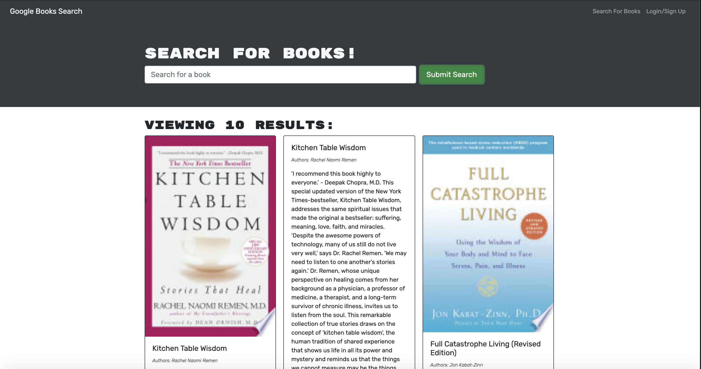

# Book Search

### Table of Contents
- [Description](#Description)
- [License](#license)
- [Technologies Used](#Technologies-Used)
- [Installation](#installation)
- [How to Use](#how-to-use)
- [Screenshots](#screenshots)
- [Contributors](#contributors)
- [Questions](#questions)

## Description
The Book Search Engine application uses the MERN stack. It is designed to allow users to login and save book searches to the back end. Google Books API search engine was used to build this application.

## License
[](https://opensource.org/licenses/MIT)

## Technologies Used
```
HTML JavaScript CSS Bootstrap

Node.JS
Express.JS
Mongoose
MongoDB
Bcrypt
Jsowebtoken
React
Graphql

```
## Installation
To install the application, 
1. Fork the repository
2. Install all independencies using
```
npm install
```

4. Start the Server using
```
npm run develop
```
5. Once the server is running, go to your web browser and view the application at http://localhost:3000/

## How to Use
This application is simple to use. It resembles a website similar to Google but for books. The user can sign up  and login. Then, they can search for books and save their searches.

## Screenshots
This is the main screen. 


This shows the signup dialog box.


This shows the login dialog box.


This shows the results of a search.


## Contributors
- Stephanie Davis

## Questions
If you have any questions, please feel free to contact me. 
- GitHub: [whatawhat](www.github.com/whatawhat) to visit my repository
- Email: stephedavis12@gmail.com

